*LSTtools: An R package to process thermal data derived from Landsat and
MODIS images*
================

### DOI: 10.5281/zenodo.4010733

## *Authors:*

### \* *Richard Lemoine Rodriguez*, Institute of Geography, Ruhr-Universität Bochum

### \* *Jean François Mas*, Centro de Investigaciones en Geografía Ambiental, Universidad Nacional Autónoma de México

## *Description*

### The LSTtools package provides tools for the analysis of thermal data derived from Landsat and MODIS satellites. It includes a number of pre-processing, processing and post-processing functions to conduct Urban Heat Island (UHI) assessments.

### This vignette describes the main use of the LSTtools package, including: (1) the steps to compute Land Surface Temperature (LST) based on Landsat 8 atmospherically corrected bands and (2) filter the quality of LST and NDVI MODIS pixels.

## Install and load the packages that will be employed

``` r
#install.packages("devtools")
#install.packages("raster")
#install.packages("RcolorBrewer")
library(devtools)
install_github("RichardLemoine/LSTtools")
library(LSTtools)
library(raster)
library(RColorBrewer)
```

## Load and define Landsat 8 bands

``` r
# Load the data
data(land8)
# Define the Landsat 8 bands that will be employed
red <- land8[[3]]
nir <- land8[[4]]
tir <- land8[[7]]
```

## Compute NDVI based on the NIR and Red bands (Rouse et al., 1974)

``` r
veg <- ndvi(nir, red)
plot(veg, col=rev(colorRampPalette(c("green4", "yellow", "firebrick"))(255)), main = "NDVI")
```

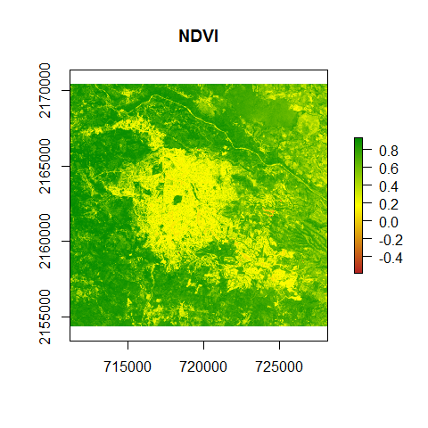<!-- -->

## Convert the DN contained in the Landsat 8 TIR band (10) to TOA brightness temperature employing the radiance multiplicative and additive band rescaling factors and K1 and K2 constants, according to USGS (2019)

``` r
br <- br_temp(tir, conv = TRUE, mult = 0.0003342, add = 0.1, k1 = 774.89, k2 = 1321.08)
plot(br, col=brewer.pal(9, 'YlOrRd'), main = "Brightness temperature (°C)")
```

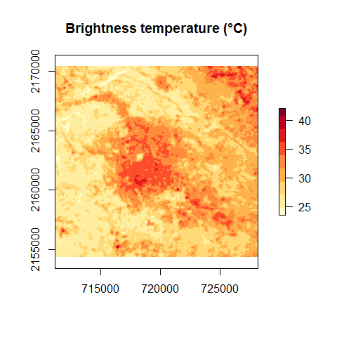<!-- -->

## Compute the per-pixel land surface emissivity employing the NDVI threshold method (Sobrino et al., 2008)

``` r
emis <- emissivity(veg, enonveg = 0.95, eveg = 0.99, pveg = FALSE)
plot(emis, main = "Emissivity", col=colorRampPalette(c("white", "black"))(255))
```

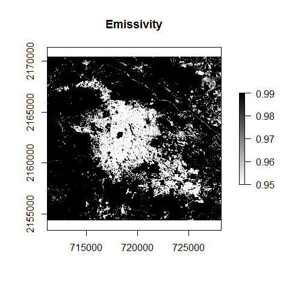<!-- -->

## Compute LST based on the inversion of the Planck function employing the brightness temperature and emissivity bands, according to USGS (2019)

``` r
lst <- landsat_lst(br, emis, sensor = "L8", conv = FALSE)
plot(lst, col=brewer.pal(9, 'YlOrRd'), main = "LST (°C)")
```

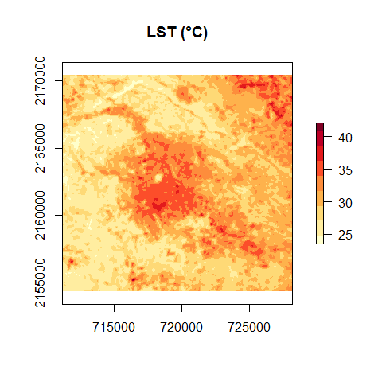<!-- -->

## Compute hot and cold spots analysis based on the Getis-Ord Gi\* statistic (Getis and Ord, 1996) and the False Discovery Rate (FDR) correction (Benjamini and Hochberg, 1995)

``` r

# Subset extent to avoid time-consuming test
e <- as(extent(716747.19, 719585.16, 2160408.248, 2163349.293), 'SpatialPolygons') 
crs(e) <- crs(lst)
lst_e <- crop(lst, e)

# Compute Getis-Ord Gi* statistic
spots <- getis(lst_e, dist = 65, p = 0.05)

# Aggregate by cluster type and plot with proper colors
r <- aggregate(spots, by = "cluster")
r$color <- ifelse(r$cluster == "Hot spot", "red", #colors for plotting
                  ifelse(r$cluster == "Cold spot", "blue", "grey"))
{plot(r, col=r$color, border=NA, axes=F, main = "Hot-cold spots")  #border="gray50" #plot
legend("bottom", ncol = 3, fill=r$color, legend = c("Cold", "Hot", "No sig."))}
```

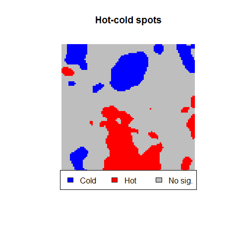<!-- -->

## Filter MODIS LST from a .hdf file according to Wan (2013) and Gawuc and Struzewska (2016)

``` r
# Load the MOD11A1 LST and Emissivity MODIS product
data(mod11a1)

# For LST day MOD11A1 product, filtering pixels with LST error <= 1 and view zenith angle <= 35
r <- lst_filter(mod11a1, time = "day", flag  = 1, angle = 35, conv = TRUE)
plot(r[[1]], col=brewer.pal(9, 'YlOrRd'), main = "Filtered LST (°C)")
```

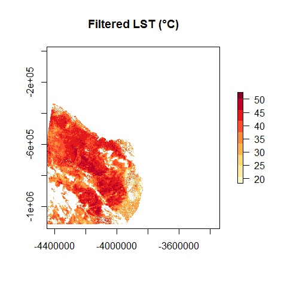<!-- -->

``` r
plot(r[[2]], main = "LST error (°C)")
```

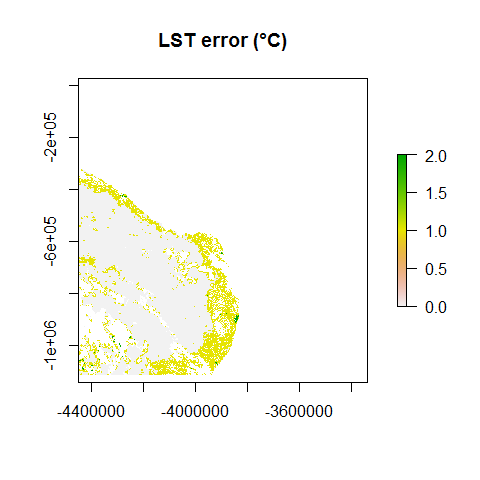<!-- -->

``` r
plot(r[[3]], main = "Viewing zenith angle (°)")
```

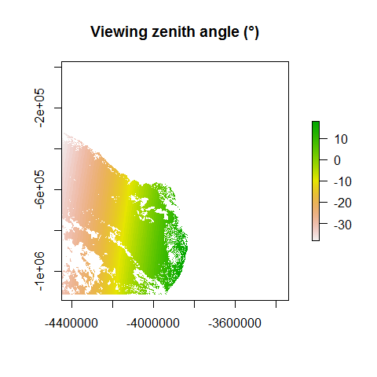<!-- -->

## Filter MODIS vegetation index from a .hdf file according to Didan et al. (2005)

``` r
# Load the MOD13A1 vegetation index MODIS product
data(mod13a1)

# For NDVI MOD13Q1 product, filtering pixels with usefulness <= 2 and view zenith angle <= 35
v <- veg_filter(mod13a1, vi = "NDVI", rel = FALSE, usef = 2, angle = 35)
plot(v[[1]], col=rev(colorRampPalette(c("green4", "yellow", "firebrick"))(255)), main = "Filtered NDVI")
```

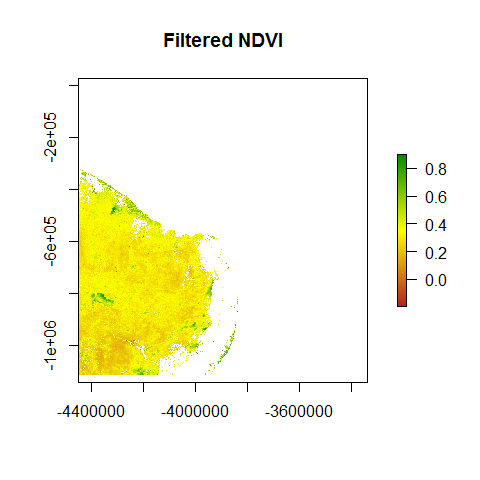<!-- -->

``` r
plot(v[[2]], main = "Reliability")
```

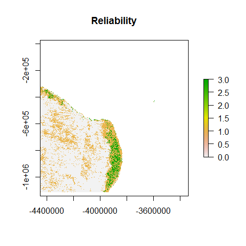<!-- -->

``` r
plot(v[[3]], main = "Usefulness")
```

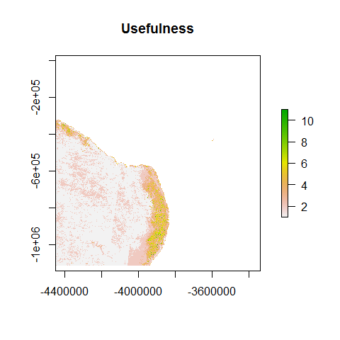<!-- -->

``` r
plot(v[[4]], main = "Viewing zenith angle (°)")
```

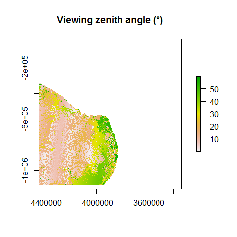<!-- -->

## *Acknowledgements*

Richard Lemoine Rodriguez acknowledges the PhD scholarship and financial
support provided by the Consejo Nacional de Ciencia y Tecnología
(CONACyT 308198/471027) and the Deutscher Akademischer Austauschdienst
(DAAD 91680266). Both authors acknowledge the funding and support of the
project “Herramientas para la Enseñanza de la Geomática con programas de
Código Abierto” of the Programa de Apoyo a Proyectos para la Innovación
y Mejoramiento de la Enseñanza (PAPIME), number PE117519, from the
National Autonomous University of Mexico.

## *References*

Benjamini, Y., and Hochberg, Y. (1995). Controlling the false discovery
rate: a practical and powerful approach to multiple testing. Journal of
the Royal Statistical Society Series B, 57, 289–300.

Didan, K. Barreto-Munoz, A., Solano, R. & Huete, A. (2015). MODIS
Vegetation Index User’s Guide (MOD13 Series) Collection-6. Arizona, USA,
32.

Gawuc, L., & Struzewska, J. (2016). Impact of MODIS quality control on
temporally aggregated urban surface temperature and long-term surface
urban heat island intensity. Remote Sensing, 8(5).

Getis, A. and Ord, J. K. (1996). Local spatial statistics: an overview.
In P. Longley and M. Batty (eds) Spatial analysis: modelling in a GIS
environment (Cambridge: Geoinformation International), 261–277.

Rouse, J. W., Haas, R. H., Schell, J. A. and Deering, D. W. (1974).
Monitoring vegetation systems in the Great Plains with ERTS, In: S.C.
Freden, E.P. Mercanti, and M. Becker (eds) Third Earth Resources
Technology Satellite–1 Syposium. Volume I: Technical Presentations, NASA
SP-351, NASA, Washington, D.C., pp. 309-317.

Sobrino, J. A., Jiménez-Muñoz, J. C., Sòria, G., Romaguera, M., Guanter,
L., Moreno, J. & Martínez, P. (2008). Land surface emissivity retrieval
from different VNIR and TIR sensors. IEEE Transactions on Geoscience and
Remote Sensing, 46(2): 316–327.

USGS. (2019). Landsat 8 data users handbook version 4. USGS Earth
Resources Observation and Science (EROS). Sioux Falls, South Dakota.
USA. 106.

Wan, Z. (2013). Collection-6 MODIS Land Surface Temperature Products
User’s guide. Santa Barbara, USA, 33.
